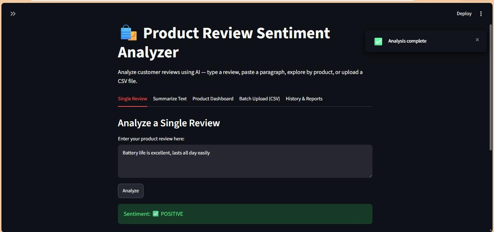
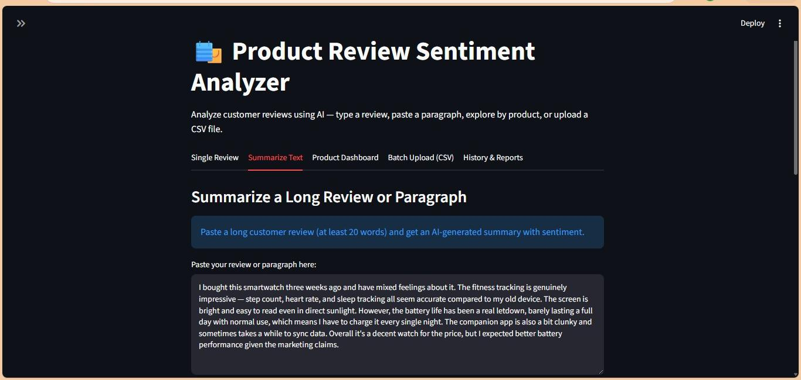
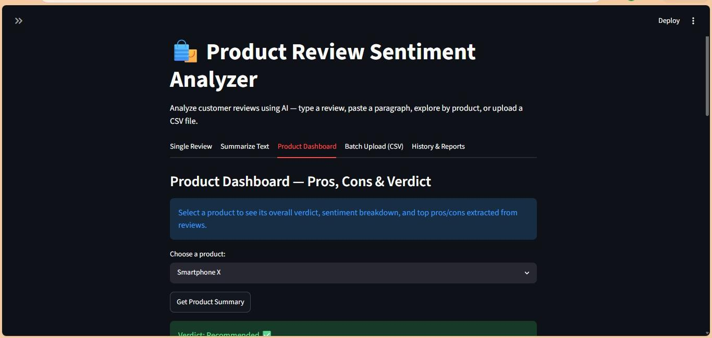
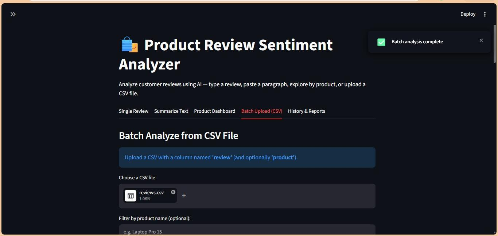
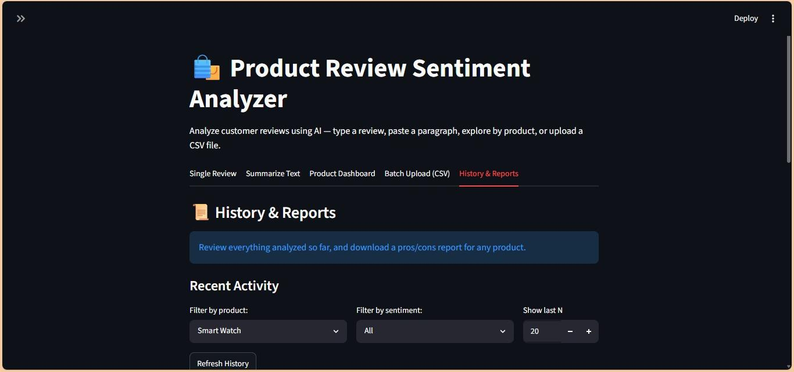

# Screenshots — Product Review Summarizer (PRJ-079)

Screenshots of all 5 tabs, captured from the running app.

---

### 1. Single Review — Sentiment Analysis
A positive review analyzed, showing the confidence score and sentiment badge.



---

### 2. Summarize Text
A long pasted paragraph with its extractive AI summary and sentiment.



---

### 3. Product Dashboard
Verdict banner, sentiment chart, and top pros/cons for a selected product.



---

### 4. Batch Upload (CSV)
`data/reviews.csv` uploaded, showing sentiment distribution and per-product breakdown.



---

### 5. History & Reports
Analysis history log and downloadable product report (Week 3).



---

**Bonus:** Sidebar showing live backend/model connection status — useful proof the deployed version works end-to-end.

```
screenshots/
├── 01_single_review.jpeg
├── 02_summarize_text.jpeg
├── 03_product_dashboard.jpeg
├── 04_batch_upload.jpeg
└── 05_history_reports.jpeg
```
